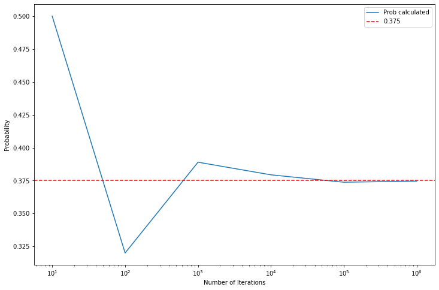

In the notebook examples, i first calculated the desired probability and then ran stimulations to check whether its gibing the correct output or not. But this method would be better used when its very difficult to calculate the probability or calculating it takes a lot of computation or time. 

