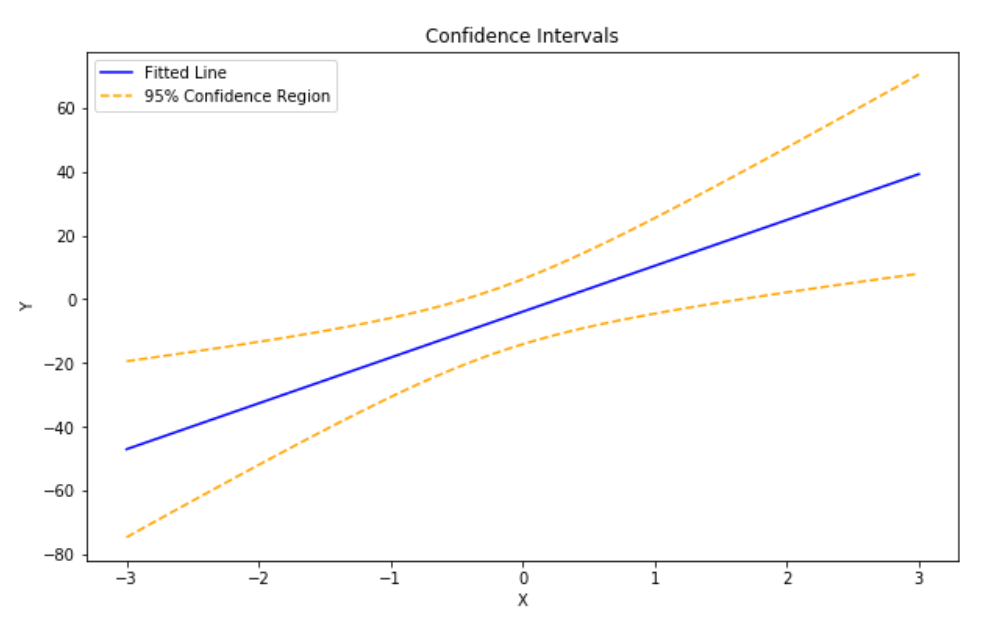
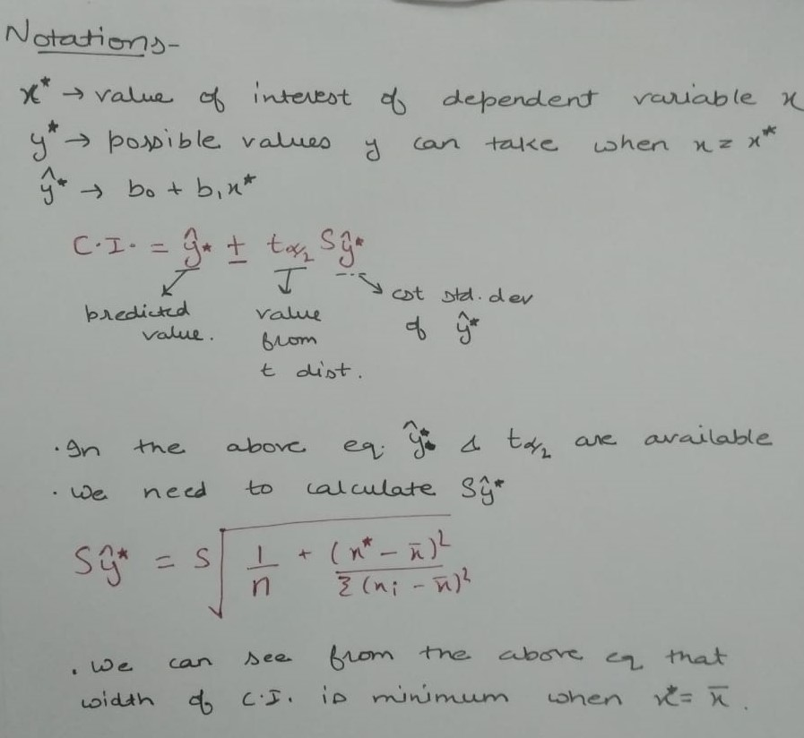

# Code
### This repository contains some of the modules that i created that are useful in using for real world data

## [My_encoder](/my_encoder)
My encoder is a module that can be used to one hot encode given vairiables of the dataset. It covers both the disadvanteges that are occured while usign OneHotEncoder and 
pd.get_dummies method. 
The notebook attached shows in detail what disadvanates are observed. And also that using my_encoder, we can get the job done is very less lines of code.

## [Confidence Intervals for Linear models](Confidence_interval_for_simple_models/confidence_interval_simple_models.ipynb)
This contains the notebook to find and visualize the confidence intervals in linear models. 

## [Scipy.optimize.curve_fit](/Scipy.optimize.curve_fit/Curve_fit_from_scipy_optimize.ipynb)
This notebook explains the curve_fit, from scipy.optimize, and provides exmaples on how it can be used to fit different functions of the data. 
In this notebook i have used a stimmulated  data to show how we can plot and potimize different functions easitly using scipy.
[scipy.optimize.curve_fit()](https://docs.scipy.org/doc/scipy/reference/generated/scipy.optimize.curve_fit.html)

### Examples from the notebook

