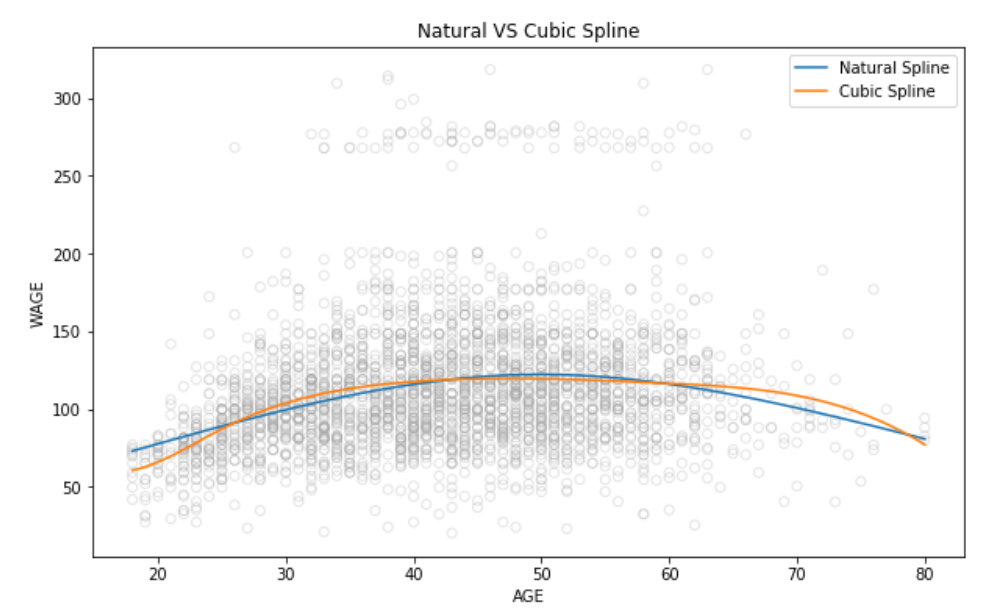

# Regression Splines
Regression Splines comes in the category of non linear Regression. In piecewise polynomials, the data is divided into different groups, and to each group a polynomial functions of a degree K are fitted. When some constrains are added to it, this piecewise polynomials turn into splines. 
The main contrains are - 
- The fitted line must be continues.
- The  derivated of the fitted line upto order of K-1 should be continoes. 

## Cubic Spling vs Natural Spline 
Natural spline has  additional boundary constraints than cubic slpine. That is a natural spline is more stable at the boundaries as compared to cubic splines 

References for the notes - [youtube_video_1](https://www.youtube.com/watch?v=H2G1OIc79qQ&t=1839s) and [you_tube_video_2](https://www.youtube.com/watch?v=KU8q_2sa1a4&t=355s)
 references -  [lab_7_ISLR](https://github.com/hardikkamboj/An-Introduction-to-Statistical-Learning/blob/master/Chapter_7/LAB%20-%20chapter%20-%207_%20Moving_beyond_linearity.ipynb)
