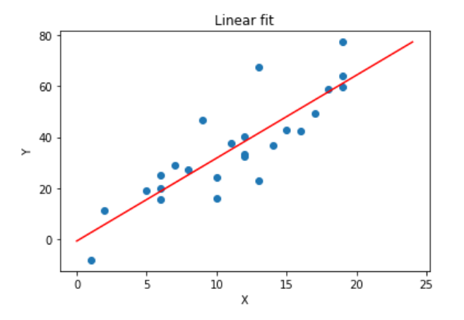
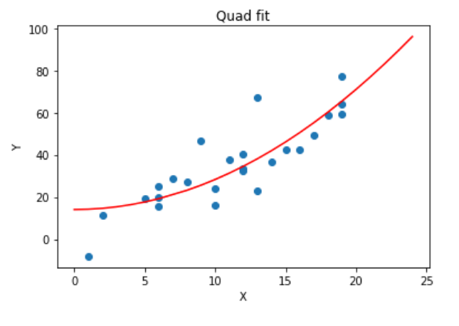

# Scipy.opimize.curve_fit
This notebook explains the curve_fit, from scipy.optimize, and provides exmaples on how it can be used to fit different functions of the data. 
In this notebook i have used a stimmulated  data to show how we can plot and potimize different functions easitly using scipy.
[scipy.optimize.curve_fit()](https://docs.scipy.org/doc/scipy/reference/generated/scipy.optimize.curve_fit.html)

